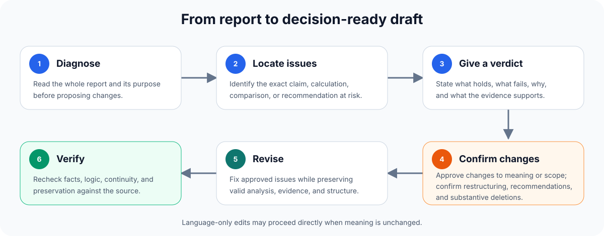

# Professional Report Reviewer

[](https://github.com/madebyalicia/professional-report-reviewer/actions/workflows/tests.yml)

[](LICENSE)


> Make sure the report holds up before someone acts on it.

Professional Report Reviewer is an Agent Skill for consultants, researchers, analysts, strategists, and other professionals whose work is reviewed repeatedly before it goes to clients, executives, boards, investment committees, or internal decision-makers.

Give it an existing report. It checks facts, calculations, reasoning, evidence, comparisons, synthesis, recommendations, structure, and professional language. It can diagnose problems, run focused comparisons, or revise approved issues while preserving the analysis that already works.

## Quick start

1. [Download the latest repository ZIP](https://github.com/madebyalicia/professional-report-reviewer/archive/refs/heads/main.zip).
2. Add the extracted skill folder through your product's Skills interface or documented local skills directory. Keep the entire folder intact.
3. Attach a small, non-confidential report and use this prompt:

```text
Use Professional Report Reviewer to review this report.
Start with the material issues and give a clear verdict on each one.
Tell me what holds, what does not, why, and what conclusion the evidence supports.
Do not change meaning, scope, structure, or recommendations before I approve the proposed changes.
```

Platform-specific installation and invocation instructions are listed under [Compatible environments](#compatible-environments).

If your environment supports installation from repository URLs, you can instead paste this repository's URL and ask: `Install the Professional Report Reviewer skill from this GitHub repository.`

## Why not just ask ChatGPT or another AI model?

ChatGPT, Claude, and Qoder provide the underlying model. This Skill provides a disciplined review process. It does not claim to replace or outperform the base model; it changes how that model approaches professional review.

> A general model can improve the writing. With this Skill, it first tests whether the report deserves its conclusions.

A polished report can still contain a wrong calculation, an unsupported conclusion, an invalid comparison, or a recommendation that does not address the diagnosed problem. A generic rewrite may make those problems sound more convincing. This Skill treats the report as existing professional work: it tests the substance first and preserves the analysis that already works.

The first column describes behavior that can occur with a generic prompt such as “review and improve this report.” Actual behavior varies by model, prompt, and tool access.

| | Direct prompt to ChatGPT, Claude, or another model | With Professional Report Reviewer |
| --- | --- | --- |
| Main job | Improve fluency and presentation | Test whether the facts, reasoning, comparisons, and recommendations hold |
| Sequence | May rewrite immediately | Diagnoses material issues before substantive revision |
| Judgment | Often returns caveats or broad warnings | States what holds, what is overstated or invalid, why, and what conclusion the evidence supports |
| Comparisons | May summarize each company or case separately | Establishes a shared, decision-relevant basis and gives an advantage, parity, disadvantage, conditional, or unresolved verdict |
| Facts and numbers | May accept statements at face value | Checks consequential public facts, definitions, dates, scope, and key calculations when the environment allows verification |
| Preservation | May compress, reorganize, or remove detail | Preserves valid facts, cases, qualifications, narrative depth, and the author's working structure |
| Material changes | May implement them silently | Explains them and asks for confirmation before changing meaning, scope, structure, or recommendations |
| Deletions | May remove content in the name of concision | Requires approval for each substantive deletion |
| Valid outcome | Usually produces edits | Can conclude that a passage or the full report needs no change |

## Worked example: when polished wording hides weak reasoning

> **Fictionalized but realistic:** The company and figures below are invented. The case represents common numerical and reasoning failures in professional reports; it is not client work or a claimed customer result.

### Before: report excerpt

> Revenue increased from 80 to 100, a 20% increase. Advertising spend rose from 10 to 20, and revenue also increased, so advertising efficiency improved. We should increase next year's advertising budget.

### A surface-level rewrite

> Revenue grew by 20% as advertising investment increased, demonstrating improved efficiency and supporting a larger budget next year.

The language is smoother, but the calculation, efficiency claim, causal leap, and recommendation remain wrong or unsupported.

### Review verdict

| Check | Professional verdict |
| --- | --- |
| Revenue growth | **Incorrect:** growth from 80 to 100 is 25%, not 20% |
| Advertising efficiency | **Contradicted by the figures:** revenue per unit of advertising spend fell from 8 to 5, a 37.5% decline |
| Causation | **Unsupported:** simultaneous increases do not show that advertising caused the additional revenue |
| Recommendation | **Do not adopt on current evidence:** a larger budget requires channel-level incremental return or comparable evidence |

### After: revision once approved

> Revenue increased from 80 to 100, a 25% increase, while advertising spend doubled from 10 to 20. Revenue per unit of advertising spend therefore fell from 8 to 5. The available figures do not establish how much of the revenue increase was caused by advertising. A broader budget increase should wait until channel-level incremental returns are assessed.

The important difference is not extra caution. It is a corrected calculation, a tested inference, a decision-ready verdict, and a revision that preserves the facts that still hold.

## Review workflow



The workflow scales with the task. A focused language edit does not need a full review package. A sound report can pass without unnecessary rewriting.

## What it reviews

| Area | What it checks |
| --- | --- |
| Facts and numbers | Public facts, dates, definitions, data scope, units, denominators, calculations, textual errors, and consistency across the report |
| Logic | Whether conclusions follow from the premises, including causal leaps, contradictions, and unsupported generalization |
| Evidence | Whether claims are supported by supplied sources or relevant public facts, and whether reported facts, grounded inferences, working hypotheses, and unsupported assertions receive the right treatment |
| Comparisons | Whether companies, cases, products, and data are compared on shared, decision-relevant criteria without mixing product, supplier, or infrastructure levels |
| Analysis | Whether the material produces a finding, mechanism, boundary, tradeoff, or useful judgment |
| Recommendations | Whether each recommendation addresses the diagnosed problem and fits the objective, resources, economics, and timing |
| Structure and narrative | Whether sections serve the main argument and each part moves the report forward |
| Consistency and revisions | Whether definitions, assumptions, conclusions, or recommendations conflict across sections, and whether a revised draft lost claims, evidence, examples, or qualifications |
| Professional language | Whether the writing is clear, precise, natural, and free of generic filler or awkward translated phrasing |

## Who it is for

Use it when a report must survive several rounds of review before external delivery or internal use. Typical users include:

- Consultants and advisory teams
- Market, industry, and policy researchers
- Strategy, corporate planning, and competitive-intelligence teams
- Investment, business, and financial analysts
- Professionals preparing management, board, or executive reports
- Anyone checking a revised report before it informs a decision

## Language support

| Report language | Review coverage |
| --- | --- |
| English | Full review of facts, reasoning, evidence, comparisons, recommendations, structure, clarity, precision, and professional tone |
| Chinese | The same full review, plus checks for awkward translated phrasing, mechanical report language, and natural professional Chinese |

The skill can receive instructions and return review findings in either English or Chinese. Output quality still depends on the selected model's language ability, context window, and file support.

## Compatible environments

The core skill follows the `SKILL.md` Agent Skills format. Compatibility below means that the platform officially documents a custom Skill mechanism based on that format. Each surface may use a different installation and invocation flow.

| Environment | Format status | Install or invoke |
| --- | --- | --- |
| [ChatGPT desktop and Codex](https://developers.openai.com/codex/skills/) | Native Agent Skills format; this package also includes `agents/openai.yaml` | Add the standalone skill in ChatGPT desktop and invoke it with `@professional-report-reviewer`. In Codex, install it as a local skill and use `$professional-report-reviewer` or `/skills`. |
| [Claude.ai](https://platform.claude.com/docs/en/agents-and-tools/agent-skills/overview) | Compatible custom Skill format | Upload the skill folder as a ZIP through the custom Skills settings. Availability depends on the Claude plan and code-execution access. |
| [Claude Code](https://code.claude.com/docs/en/skills) | Compatible filesystem-based Skill | Copy the folder to `~/.claude/skills/professional-report-reviewer/` or `.claude/skills/professional-report-reviewer/`, then use `/professional-report-reviewer` or ask naturally. |
| [Qoder IDE and CLI](https://docs.qoder.com/extensions/skills) | Compatible `SKILL.md` Skill | Install from GitHub with the Skills CLI or copy the folder to `~/.qoder/skills/professional-report-reviewer/`. Invoke it with `/professional-report-reviewer` or ask naturally. |
| [QoderWork](https://docs.qoder.com/qoderwork/skills) | Compatible uploaded or filesystem Skill | Paste the GitHub repository link and ask QoderWork to install it, upload `SKILL.md` with its supporting files through the Skills page, or place the folder in `~/.qoderwork/skills/`. |
| Other agents that read `SKILL.md` | Expected to work at the instruction level | Point the agent to `SKILL.md`. File access, web verification, scripts, and invocation syntax depend on the host. |

## More ways to use it

Attach the complete report and ask in plain language. Invocation syntax varies by product.

### Competitor or case comparison

```text
Use Professional Report Reviewer to examine the comparison in this report.
Put the companies and cases on a common, decision-relevant basis.
Identify incomparable evidence, explain the differences that matter, and give a clear verdict.
```

### Compare two drafts

```text
Use Professional Report Reviewer to compare the original and revised reports.
Find any lost claims, facts, examples, qualifications, recommendations, or changes in certainty and scope.
Do not rewrite either version.
```

### Chinese language review

```text
Use Professional Report Reviewer to edit the Chinese in this report.
Keep the claims, conclusions, structure, examples, and all substantive content.
Remove awkward translated phrasing and make the language natural and professional.
Flag factual or logical problems separately.
```

## Editing boundaries

Language and formatting edits can be applied directly when they preserve meaning. Changes to claims, certainty, scope, recommendations, taxonomy, or structure require confirmation.

Every proposed deletion of substantive content must identify:

- The exact location
- What would disappear
- Why removal is recommended
- What the report would lose or gain
- A less destructive alternative, when one exists

The final revision is checked against the source for meaning, scope, evidence, examples, recommendations, continuity, and numbering.

## Repository structure

| Path | Purpose |
| --- | --- |
| `SKILL.md` | Core workflow, decision rules, and editing boundaries |
| `references/review-criteria.md` | Detailed checks for facts, numbers, logic, comparisons, recommendations, and professional Chinese |
| `references/analytical-contribution-gate.md` | Tests whether a section contributes analysis instead of filler |
| `references/output-formats.md` | Output shapes for review-only, revision, and focused-edit tasks |
| `references/behavioral-regression.md` | Maintenance and regression guidance |
| `scripts/` | Deterministic checks for selected clean-draft issues |
| `tests/` | Behavioral cases used to test the review rules |
| `agents/openai.yaml` | Optional display metadata for ChatGPT and Codex |
| `assets/` | Repository and interface visuals, including the workflow diagram and skill icon |
| `VERSION` | Current public version number |

## Project status

Version 0.1.0 is the first public version of Professional Report Reviewer. Its rules are informed by recurring failures in professional report review. The repository includes deterministic checks and behavioral regression fixtures, but these do not establish production reliability or universal cross-platform performance.

Results vary by model, context length, file-handling support, tool access, and subject matter. Keep a qualified human reviewer in the loop when a report will influence an important external or internal decision.

## Privacy

This project does not run an independent document-upload service. Your report is handled by the AI environment you choose, subject to that product's privacy policy and your organization's information-security requirements.

Do not post confidential reports, client names, unpublished data, or personal information in public issues. A short, anonymized example is usually enough to reproduce a problem.

## Feedback

Useful issue reports include:

- A valid inference was dismissed as unsupported
- A material logic error was missed
- Incomparable evidence received only a vague warning
- A rewrite removed facts, examples, qualifications, or judgments
- The revised language became generic, awkward, or less natural
- The same case produced materially different behavior across models

When possible, include an anonymized source passage, the actual review output, and the result you expected.

## License

Licensed under the [PolyForm Perimeter License 1.0.1](https://polyformproject.org/licenses/perimeter/1.0.1).

You may use, modify, and share the project for permitted purposes, including personal work, internal company work, and paid professional work, provided that you do not use it to offer others a product that competes with this software. When distributing copies, you must also provide the license terms or the license URL and preserve any required notices. The project is source-available and is not licensed under MIT. See `LICENSE` for the exact terms.

## Maintainer

Created and maintained by [madebyalicia](https://github.com/madebyalicia).
